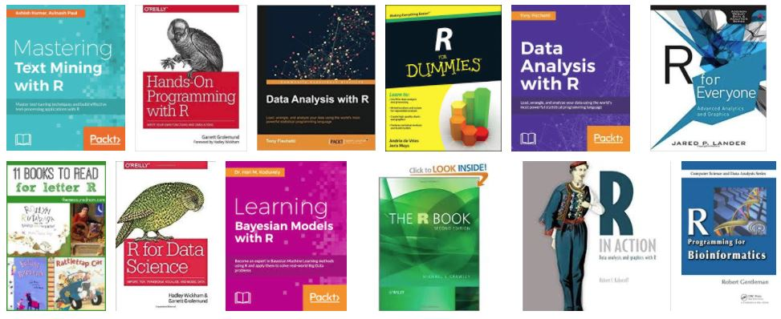
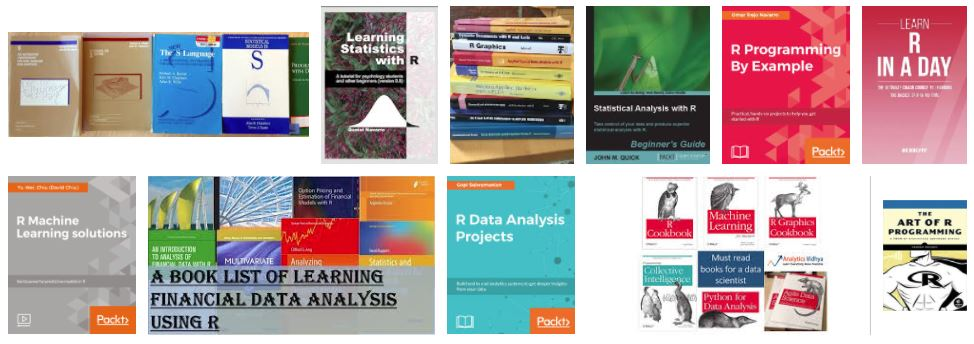
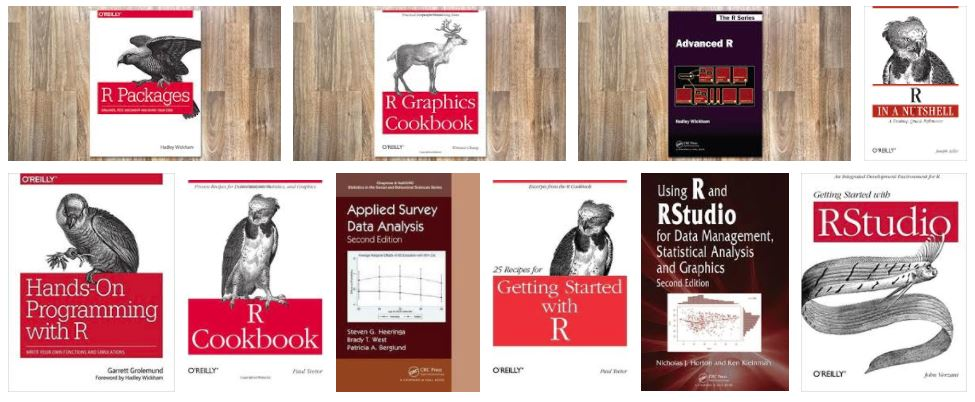
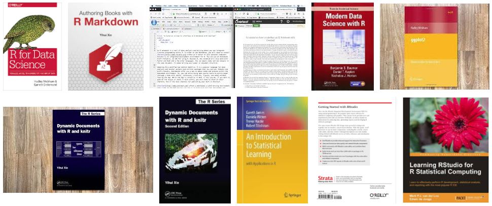

# R.Books

###重点推荐一下基本R书籍
**（Highlight the following R books）**

- [R for Beginners CN](https://github.com/PhDMeiwp/R.Books/blob/R.Books/BookList/R%20for%20Beginners%20CN.pdf)
- [R for Business Analytics](https://github.com/PhDMeiwp/R.Books/blob/R.Books/BookList/R%20for%20Business%20Analytics.pdf)
- [R for Data Science]((https://github.com/PhDMeiwp/R.Books/blob/R.Books/BookList/R%20for%20Data%20Science.pdf))
- [R for Programmers](https://github.com/PhDMeiwp/R.Books/blob/R.Books/BookList/R%20for%20Programmers.pdf)
- [Hands-On Programming with R](https://github.com/PhDMeiwp/R.Books/blob/R.Books/BookList/Hands-On%20Programming%20with%20R.pdf)
- [The R Book (Second Edition)](https://github.com/PhDMeiwp/R.Books/blob/R.Books/BookList/The%20R%20Book%20(Second%20Edition).pdf)

 
 
  
 
  
 
  